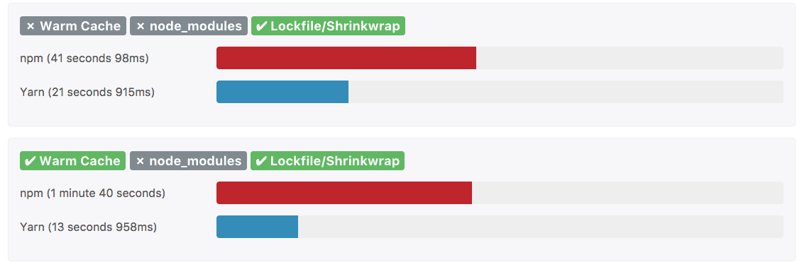

## Andreas Offenhäuser

* senior backend developer @ Bosch
* connected vehicles
* microservice architect
* node enthusiast
* biker, diver, skier

---

## what is yarn

> Yarn is a new package manager that replaces the existing workflow for the npm client or other package managers while remaining compatible with the npm registry. It has the same feature set as existing workflows while operating faster, more securely, and more reliably.

https://code.facebook.com/posts/1840075619545360

----

## why yarn
Facebook engineers struggled with `npm`s missing capability to handle big projects

> the size of our codebase and the number of engineers grew, we ran into problems with consistency, security, and performance

----

## (claimed) improvements over npm
* faster
* more secure
* reliability

---

# why is it..

----

## ..faster
Installation runs over all missing deps in parallel

----

https://yarnpkg.com/en/compare
