# Andreas Offenhäuser


* senior backend developer @ Bosch
* connected vehicles
* microservice architect
* node enthusiast
* biker, diver, skier

@offenhaeuser

github.com/anoff


---


# what is yarn

> Yarn is a new package manager that replaces the existing workflow for the npm client or other package managers while remaining compatible with the npm registry. It has the same feature set as existing workflows while operating faster, more securely, and more reliably.

https://code.facebook.com/posts/1840075619545360


----


## why yarn
Facebook engineers struggled with `npm`s missing capability to handle big projects

> the size of our codebase and the number of engineers grew, we ran into problems with consistency, security, and performance


----


## (claimed) improvements over npm
* faster
* more secure
* reliability


---


# why is it..


----


## ..faster
Installation runs over all missing deps in parallel



Note: all resolutions, then all fetches then all links


----


https://yarnpkg.com/en/compare


----


## ..reliable
introducing `yarn.lock` - npm-shrinkwrap on steroids

```
# yarn lockfile v1
abab@^1.0.0:
  version "1.0.3"
  resolved "https://registry.yarnpkg.com/abab/-/abab-1.0.3.tgz#b81de5f7274ec4e756d797cd834f303642724e5d"
```


----


* keeps the exact versions that have been installed
* source of resolved package
* tarball hash
* exact order in which packages were/will be installed


----


## ..more secure
tarball checksums are stored in `yarn.lock` and verified upon install


---


# migration
`npm install -g yarn`


----


`npm install` ➜ `yarn`

`npm --save install <pkg>` ➜ `yarn add <pkg>`

Note:
* license generator
* license blacklisting

----


keep your `package.json`

DONE.


---


#demo time


---


# day1 experiences

* local tests showed significant speed boost
* drop-in replacement for `npm`
* CI builds 20~40% faster

Note: even more possible with bundled yarn in CI agent


----


# problems
..we couldn't solve fast enough

* enforced _engine_ check
* random `invalid tar file` errors breaking the CI


Note:
* packages with strict node semver crash the install
* tar error apparently solved by v0.16.1 release, to be checked
> https://github.com/yarnpkg/yarn/issues/834


---


# should I use yarn?
* If you care about speed
  * test it on your setup
* ..otherwise
  * test it on your setup
